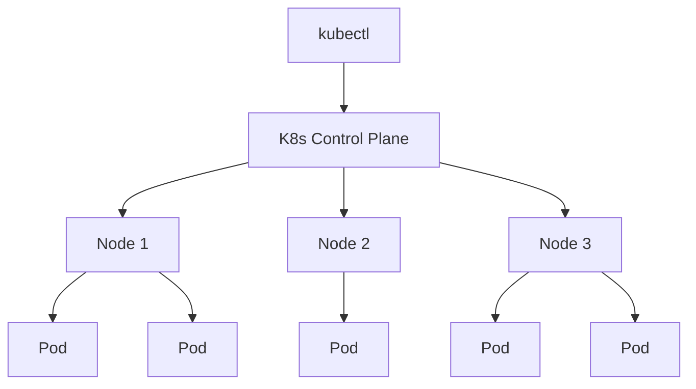

# Getting Started with Kubernetes

Welcome to the **Kubernetes with Docker Desktop and Kind** lab! By the end of this lab, you will be able to:

- Create single-node and multi-node Kubernetes clusters using Kind
- Deploy and manage applications with Pods, Deployments, and Services
- Scale applications and perform rolling updates
- Convert Docker Compose files into Kubernetes manifests

## What is Kubernetes?

Kubernetes (K8s) is an open-source container orchestration platform that automates deploying, scaling, and managing containerized applications. While Docker is great for running individual containers, Kubernetes manages fleets of containers across one or more nodes.



## Kubernetes on Docker Desktop

Docker Desktop ships with a built-in single-node Kubernetes cluster. There are two ways to enable it:

**Option A: Via the GUI**
Navigate to **Settings > Kubernetes > Enable Kubernetes** and click **Apply & Restart**.

**Option B: Via the CLI** (Docker Desktop 4.32+)

```bash no-run-button
# Enable the built-in Kubernetes cluster
docker desktop kubernetes enable

# Check its status
docker desktop kubernetes status
```

> [!NOTE]
> The `docker desktop` CLI commands interact with the Docker Desktop application on your host machine. They are shown here for reference — on your own workstation, this is the quickest way to get a single-node K8s cluster running.

Docker Desktop's built-in Kubernetes is great for quick local development, but it only supports a **single node**. For this lab, you will use **Kind** (Kubernetes in Docker) instead. Kind lets you create both single-node and multi-node clusters using Docker containers as nodes — giving you a more realistic, production-like environment.

## Verify your environment

Start by confirming that Docker is available in this lab environment.

1. Check that Docker is running:

    ```bash
    docker version --format '{{.Server.Version}}'
    ```

2. Verify Docker can run containers:

    ```bash
    docker run --rm hello-world
    ```

    You should see the "Hello from Docker!" message.

## Verify kubectl

Docker Desktop bundles `kubectl` automatically. Confirm it is available:

1. Check the `kubectl` version:

    ```bash
    kubectl version --client
    ```

    You should see the client version printed. The server connection warning is expected — you have not created a cluster yet!

## Quick reference: kubectl commands

Here are the most common `kubectl` patterns you will use throughout this lab:

| Command | Description |
|---------|-------------|
| `kubectl get <resource>` | List resources |
| `kubectl describe <resource> <name>` | Show detailed info |
| `kubectl apply -f <file>` | Create or update from a YAML file |
| `kubectl delete <resource> <name>` | Delete a resource |
| `kubectl logs <pod>` | View Pod logs |
| `kubectl config get-contexts` | List available clusters |

Your environment is ready — Docker is running and `kubectl` is available. In the next section, you will install Kind and create your first Kubernetes clusters.
