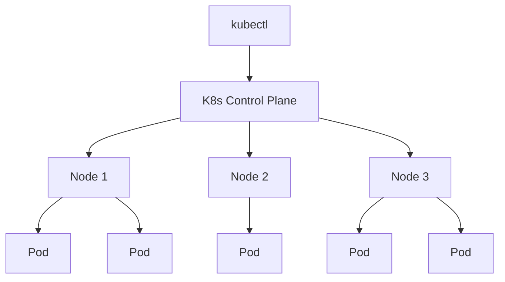

# Enable Kubernetes on Docker Desktop

Welcome to the **Kubernetes on Docker Desktop** lab! By the end of this lab, you will be able to:

- Enable and manage Kubernetes directly from Docker Desktop
- Create single-node and multi-node clusters
- Deploy and manage applications with Pods, Deployments, and Services
- Convert Docker Compose files into Kubernetes manifests

## What is Kubernetes?

Kubernetes (K8s) is an open-source container orchestration platform that automates deploying, scaling, and managing containerized applications. While Docker is great for running individual containers, Kubernetes manages fleets of containers across one or more nodes.



## Kubernetes on Docker Desktop

Docker Desktop (4.51+) ships with built-in Kubernetes support. No external tools or installers needed — everything is managed from the Docker Desktop Dashboard.

Docker Desktop offers two cluster types:

| Type | Description |
|------|-------------|
| **Kubeadm** | Single-node cluster. Docker Desktop manages the K8s version. Best for quick local development. |
| **Kind** | Multi-node cluster. You can customize the K8s version and number of nodes. Best for realistic, production-like testing. |

## Enable a single-node cluster (Kubeadm)

1. Open the **Docker Desktop Dashboard**
2. Navigate to the **Kubernetes** view from the left sidebar
3. Select **Create cluster**
4. Choose **Kubeadm** as the cluster type
5. Select **Create**

Docker Desktop will pull the required images, install `kubectl`, generate certificates, and boot the cluster. This takes a couple of minutes.

> [!TIP]
> You can also enable Kubernetes from **Settings > Kubernetes > Enable Kubernetes** and click **Apply & Restart**.

## Verify the cluster

Once the cluster is ready, `kubectl` is automatically available. Verify everything is working:

1. Check the nodes in your cluster:

    ```bash
    kubectl get nodes
    ```

    You should see your nodes with `Ready` status. For a Kubeadm cluster you will see a single `docker-desktop` node. For a Kind cluster you will see `desktop-control-plane` and `desktop-worker` nodes:

    ```plaintext no-copy-button
    NAME                    STATUS   ROLES           AGE   VERSION
    desktop-control-plane   Ready    control-plane   13m   v1.34.3
    desktop-worker          Ready    <none>          13m   v1.34.3
    ```

2. Confirm which cluster context `kubectl` is using:

    ```bash
    kubectl config current-context
    ```

3. Check the cluster info:

    ```bash
    kubectl cluster-info
    ```

## Your first deployment

Follow the official Docker docs pattern to deploy a simple application.

1. A sample manifest `bb.yaml` is already in your project directory. Review it:

    ```bash
    cat bb.yaml
    ```

    This file defines a Deployment (nginx container) and a NodePort Service (exposed on port 30001).
    ```

2. Deploy the application:

    ```bash
    kubectl apply -f bb.yaml
    ```

3. Verify the Deployment is ready:

    ```bash
    kubectl get deployments
    ```

4. Check the Service:

    ```bash
    kubectl get services
    ```

    You should see `bb-entrypoint` with a `NodePort` on port `30001`.

5. Test the application using `kubectl port-forward`:

    ```bash
    kubectl port-forward svc/bb-entrypoint 30001:80 &
    ```

6. Curl the forwarded port:

    ```bash
    curl -s http://localhost:30001
    ```

    You should see the nginx welcome page HTML.

    > [!NOTE]
    > On Docker Desktop, Kind nodes run inside a VM, so NodePort is not directly reachable via `localhost`. Use `kubectl port-forward` to access services from your Mac.

7. Stop the port-forward:

    ```bash
    kill %1 2>/dev/null
    ```

6. Clean up when done:

    ```bash
    kubectl delete -f bb.yaml
    ```

## Quick reference: kubectl commands

Here are the most common `kubectl` patterns you will use throughout this lab:

| Command | Description |
|---------|-------------|
| `kubectl get <resource>` | List resources |
| `kubectl describe <resource> <name>` | Show detailed info |
| `kubectl apply -f <file>` | Create or update from a YAML file |
| `kubectl delete -f <file>` | Delete resources defined in a file |
| `kubectl logs <pod>` | View Pod logs |
| `kubectl config get-contexts` | List available clusters |

You now have a working single-node Kubernetes cluster on Docker Desktop. In the next section, you will create a multi-node cluster using Docker Desktop's built-in Kind support.
