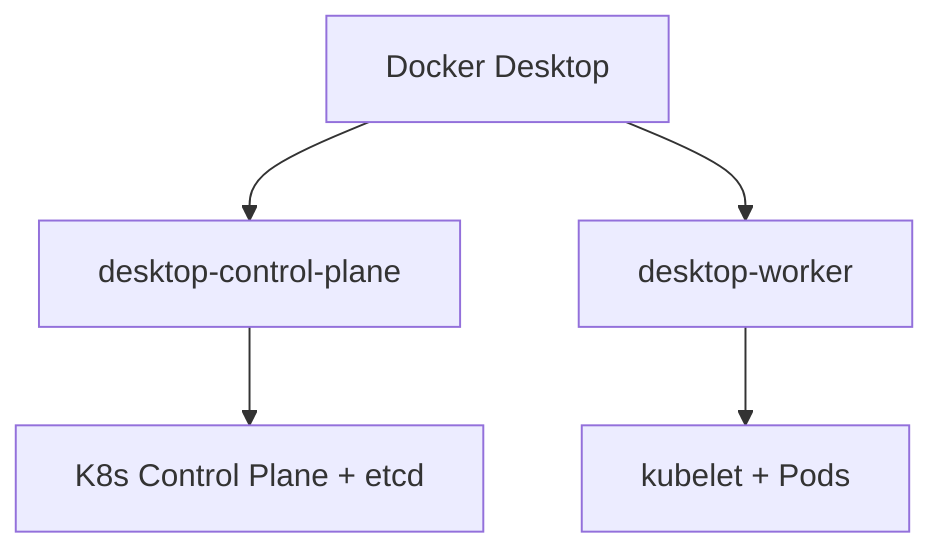

# Multi-Node Clusters with Kind

Docker Desktop's single-node Kubeadm cluster is great for quick testing, but production Kubernetes runs across multiple nodes. Docker Desktop (4.51+) has **Kind** (Kubernetes in Docker) built in, letting you create multi-node clusters without installing anything extra.



With Kind, each Kubernetes node runs as a Docker container managed by Docker Desktop. These containers are hidden by default but can be revealed by enabling **"Show system containers"** in settings. This lets you simulate a real multi-node cluster entirely on your local machine.

## Create a multi-node cluster from Docker Desktop

1. Open the **Docker Desktop Dashboard**
2. Navigate to the **Kubernetes** view from the left sidebar
3. Select **Create cluster**
4. Choose **Kind** as the cluster type
5. Set the number of **worker nodes** (e.g., 1 for a 2-node cluster)
6. Optionally choose a specific Kubernetes version
7. Select **Create**

Docker Desktop will create containers for each node and configure Kubernetes networking between them. This takes a couple of minutes.

## Verify the multi-node cluster

1. List all nodes in the cluster:

    ```bash
    kubectl get nodes
    ```

    You should see the control-plane and worker nodes with `Ready` status:

    ```plaintext no-copy-button
    NAME                    STATUS   ROLES           AGE   VERSION
    desktop-control-plane   Ready    control-plane   13m   v1.34.3
    desktop-worker          Ready    <none>          13m   v1.34.3
    ```

2. Get more details about the nodes:

    ```bash
    kubectl get nodes -o wide
    ```

    This shows the internal IPs, OS image, and container runtime for each node.

3. View the Kubernetes system containers with `docker ps`:

    By default, Docker Desktop hides its internal containers. To see them, go to **Settings > Kubernetes** and enable **"Show system containers (advanced)"**.

    Once enabled, run:

    ```bash
    docker ps --format "table {{.Names}}\t{{.Image}}\t{{.Status}}"
    ```

    You should now see the Kind node containers (e.g., `desktop-control-plane`, `desktop-worker`) alongside the regular containers.

    > [!TIP]
    > This is useful for debugging — you can inspect, exec into, or view logs of the node containers just like any other Docker container.

## Explore node details

1. Describe the control-plane node to see its capacity and conditions:

    ```bash
    kubectl describe node desktop-control-plane
    ```

    Look for the **Allocatable** section — it shows how much CPU and memory the node can give to Pods.

2. Describe the worker node:

    ```bash
    kubectl describe node desktop-worker
    ```

3. Check which Pods are running on each node:

    ```bash
    kubectl get pods -A -o wide
    ```

    The `-A` flag shows Pods in all namespaces. System components like `coredns`, `kube-proxy`, and `etcd` are spread across the nodes.

## Switch between clusters

If you have both a Kubeadm and a Kind cluster, you can switch between them:

1. List all available contexts:

    ```bash
    kubectl config get-contexts
    ```

2. Switch to a specific context:

    ```bash no-run-button
    kubectl config use-context <context-name>
    ```

3. Verify the current context:

    ```bash
    kubectl config current-context
    ```

> [!NOTE]
> For the rest of this lab, make sure you are using the **Kind multi-node cluster**. Check with `kubectl get nodes` — you should see `desktop-control-plane` and `desktop-worker`.

## Kubeadm vs Kind — when to use which

| Feature | Kubeadm (Docker Desktop) | Kind (Docker Desktop) |
|---------|--------------------------|----------------------|
| Nodes | Single node | Multiple nodes |
| Setup | One click | One click |
| Node naming | `docker-desktop` | `desktop-control-plane`, `desktop-worker` |
| Multi-node | No | Yes |
| Best for | Quick local dev | Realistic testing, CI/CD |

You now have a multi-node Kubernetes cluster running entirely through Docker Desktop. In the next section, you will deploy your first workloads as Pods.
