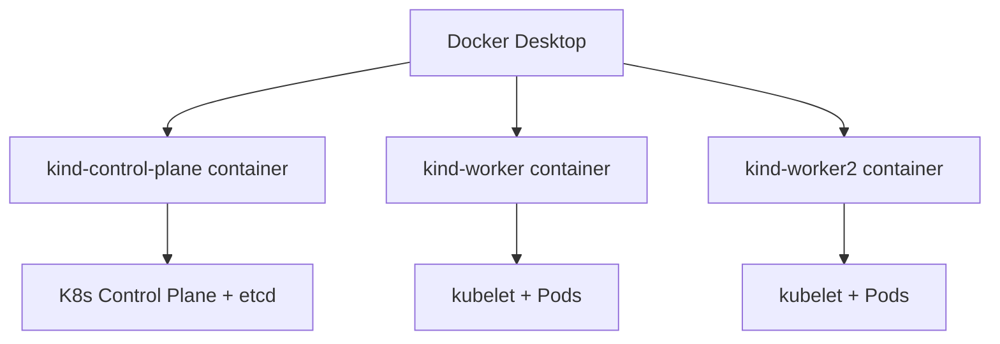

# Multi-Node Clusters with Kind

Docker Desktop's single-node Kubeadm cluster is great for quick testing, but production Kubernetes runs across multiple nodes. Docker Desktop (4.51+) has **Kind** (Kubernetes in Docker) built in, letting you create multi-node clusters without installing anything extra.



With Kind, each Kubernetes "node" runs as a Docker container. This lets you simulate a real multi-node cluster entirely on your local machine.

## Create a multi-node cluster from Docker Desktop

1. Open the **Docker Desktop Dashboard**
2. Navigate to the **Kubernetes** view
3. Select **Create cluster**
4. Choose **Kind** as the cluster type
5. Set the number of **worker nodes** (e.g., 2)
6. Optionally choose a specific Kubernetes version
7. Select **Create**

Docker Desktop will create Docker containers for each node and configure Kubernetes networking between them.

## Verify the multi-node cluster

1. List all nodes in the cluster:

    ```bash
    kubectl get nodes
    ```

    You should see three nodes — one control-plane and two workers:

    ```plaintext no-copy-button
    NAME                  STATUS   ROLES           AGE   VERSION
    kind-control-plane    Ready    control-plane   2m    v1.32.3
    kind-worker           Ready    <none>          90s   v1.32.3
    kind-worker2          Ready    <none>          90s   v1.32.3
    ```

2. Get more details about the nodes:

    ```bash
    kubectl get nodes -o wide
    ```

    This shows the internal IPs, OS image, and container runtime for each node.

3. Look at the Docker containers backing the cluster:

    ```bash
    docker ps --filter "label=io.x-k8s.kind.cluster"
    ```

    Each Kubernetes node is a Docker container running on your machine.

## Explore node details

1. Describe a specific node to see its capacity and conditions:

    ```bash
    kubectl describe node kind-control-plane
    ```

    Look for the **Allocatable** section — it shows how much CPU and memory the node can give to Pods.

2. Check which Pods are running on each node:

    ```bash
    kubectl get pods -A -o wide
    ```

    The `-A` flag shows Pods in all namespaces. System components like `coredns`, `kube-proxy`, and `etcd` are spread across the nodes.

## Switch between clusters

If you have both a Kubeadm and a Kind cluster, you can switch between them:

1. List all available contexts:

    ```bash
    kubectl config get-contexts
    ```

    You should see entries like `docker-desktop` (Kubeadm) and `kind-kind` (Kind).

2. Switch to the Kind cluster:

    ```bash
    kubectl config use-context kind-kind
    ```

3. Switch back to the Docker Desktop Kubeadm cluster:

    ```bash
    kubectl config use-context docker-desktop
    ```

> [!NOTE]
> For the rest of this lab, make sure you are using the **Kind multi-node cluster**. Run `kubectl config use-context kind-kind` if needed.

## Kubeadm vs Kind — when to use which

| Feature | Kubeadm (Docker Desktop) | Kind (Docker Desktop) |
|---------|--------------------------|----------------------|
| Nodes | Single node | Multiple nodes |
| Setup | One click | One click |
| Node type | VM-based | Docker containers |
| Multi-node | No | Yes |
| Best for | Quick local dev | Realistic testing, CI/CD |

You now have a multi-node Kubernetes cluster running entirely through Docker Desktop. In the next section, you will deploy your first workloads as Pods.
