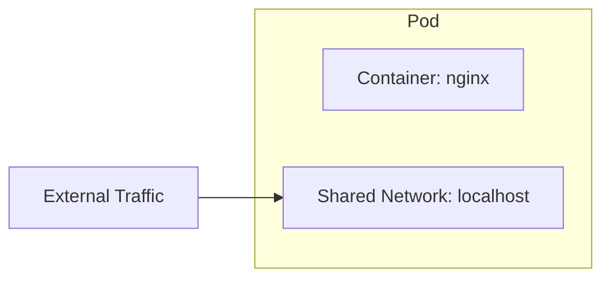

# Working with Pods

A **Pod** is the smallest deployable unit in Kubernetes. It represents one or more containers that share networking and storage. In most cases, a Pod runs a single container.



## Run your first Pod

The quickest way to create a Pod is with `kubectl run`:

1. Create an nginx Pod:

    ```bash
    kubectl run my-nginx --image=nginx:alpine --restart=Never
    ```

2. Check that it is running:

    ```bash
    kubectl get pods
    ```

    Wait until the `STATUS` column shows `Running`.

3. Get detailed information about the Pod:

    ```bash
    kubectl describe pod my-nginx
    ```

    This shows events, the container image, the node it was scheduled on, IP address, and more.

## Create a Pod from YAML

For repeatable deployments, you define Pods in YAML manifests. A sample Pod manifest is included in your workspace.

1. Review the sample Pod manifest included in your project:

    ```bash
    cat k8s/pod.yaml
    ```

    This manifest defines a Pod running a simple HTTP echo server that responds with "Hello from Kubernetes!". It has labels (`app: hello`, `tier: frontend`) that you will use later for filtering.

2. Apply the manifest to create the Pod:

    ```bash
    kubectl apply -f k8s/pod.yaml
    ```

3. Watch the Pod start up:

    ```bash
    kubectl get pods -w
    ```

    Press `Ctrl+C` once the Pod shows `Running`.

## Interact with a Pod

1. View the Pod's logs:

    ```bash
    kubectl logs hello-app
    ```

2. Forward traffic from your terminal to the Pod (runs in the background):

    ```bash
    kubectl port-forward pod/hello-app 8080:8080 &
    ```

3. Test the endpoint:

    ```bash
    curl http://localhost:8080
    ```

    You should see: `Hello from Kubernetes!`

4. Stop the port-forward:

    ```bash
    kill %1 2>/dev/null
    ```

## Pod labels and selectors

Labels are key-value pairs attached to Kubernetes objects. They are used to organize and select groups of resources.

1. List Pods with their labels:

    ```bash
    kubectl get pods --show-labels
    ```

2. Filter Pods by label:

    ```bash
    kubectl get pods -l app=hello
    ```

3. Add a label to the `my-nginx` Pod:

    ```bash
    kubectl label pod my-nginx tier=frontend
    ```

4. Now both Pods match the `tier=frontend` selector:

    ```bash
    kubectl get pods -l tier=frontend
    ```

## Clean up Pods

Delete both Pods before moving on:

```bash
kubectl delete pod my-nginx hello-app
```

Verify they are gone:

```bash
kubectl get pods
```

> [!IMPORTANT]
> Pods by themselves do not restart if they crash or get deleted. In production, you almost never create Pods directly. Instead, you use **Deployments**, which you will learn about next.

You now understand how to create, inspect, and manage Pods. In the next section, you will use Deployments to run resilient, scalable applications.
