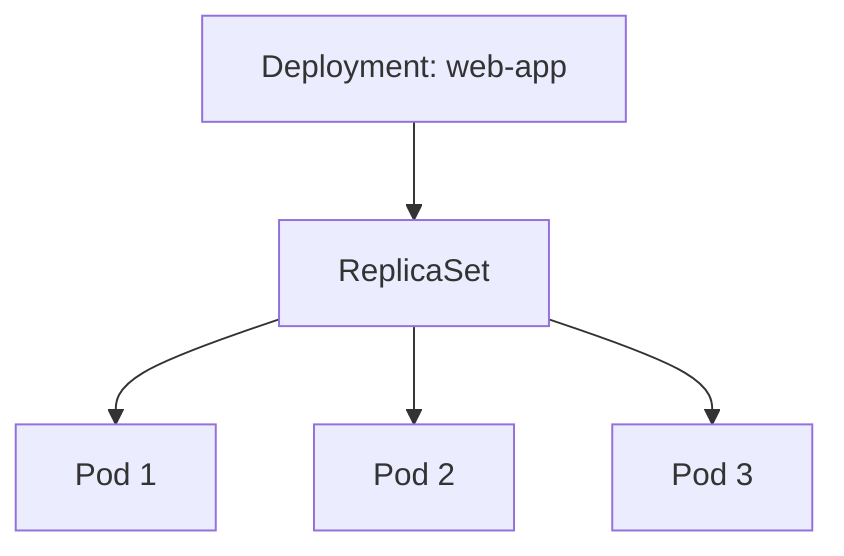

# Deployments and Scaling

A **Deployment** manages a set of identical Pods, ensuring the desired number of replicas are always running. If a Pod crashes, the Deployment automatically creates a replacement. Deployments also enable rolling updates with zero downtime.



## Create a Deployment

1. Open :fileLink[k8s/deployment.yaml]{path="k8s/deployment.yaml"} to review it:

    ```yaml no-run-button
    apiVersion: apps/v1
    kind: Deployment
    metadata:
      name: web-app
      labels:
        app: web-app
    spec:
      replicas: 2
      selector:
        matchLabels:
          app: web-app
      template:
        metadata:
          labels:
            app: web-app
        spec:
          containers:
            - name: web
              image: nginx:1.27-alpine
              ports:
                - containerPort: 80
              resources:
                requests:
                  memory: "64Mi"
                  cpu: "50m"
                limits:
                  memory: "128Mi"
                  cpu: "100m"
    ```

    Key fields:
    - **replicas: 2** — Kubernetes will maintain exactly 2 Pods
    - **selector** — tells the Deployment which Pods it manages (by label)
    - **template** — defines the Pod spec used for every replica

2. Apply the Deployment:

    ```bash
    kubectl apply -f k8s/deployment.yaml
    ```

3. Watch the Pods come up:

    ```bash
    kubectl get pods -l app=web-app -w
    ```

    Press `Ctrl+C` once both Pods show `Running`.

4. Inspect the Deployment:

    ```bash
    kubectl get deployment web-app
    ```

    The `READY` column should show `2/2`.

## Scale the Deployment

Scaling changes the number of replicas. Kubernetes creates or terminates Pods to match.

1. Scale up to 5 replicas:

    ```bash
    kubectl scale deployment web-app --replicas=5
    ```

2. Watch the new Pods being created:

    ```bash
    kubectl get pods -l app=web-app
    ```

3. Check which nodes the Pods are running on:

    ```bash
    kubectl get pods -l app=web-app -o wide
    ```

    In your multi-node Kind cluster, Pods should be spread across the worker nodes.

4. Scale back down to 3 replicas:

    ```bash
    kubectl scale deployment web-app --replicas=3
    ```

5. Verify that extra Pods are being terminated:

    ```bash
    kubectl get pods -l app=web-app
    ```

## Perform a rolling update

Rolling updates let you change the container image without downtime. Kubernetes gradually replaces old Pods with new ones.

1. Update the nginx image version:

    ```bash
    kubectl set image deployment/web-app web=nginx:1.27
    ```

2. Watch the rollout progress:

    ```bash
    kubectl rollout status deployment/web-app
    ```

3. Verify the new image is in use:

    ```bash
    kubectl describe deployment web-app | grep Image
    ```

4. Check the rollout history:

    ```bash
    kubectl rollout history deployment/web-app
    ```

## Roll back a Deployment

If something goes wrong, you can roll back to the previous version instantly.

1. Simulate a bad update with a non-existent image:

    ```bash
    kubectl set image deployment/web-app web=nginx:does-not-exist
    ```

2. Watch the Pods — the new ones will be stuck in `ErrImagePull` or `ImagePullBackOff`:

    ```bash
    kubectl get pods -l app=web-app
    ```

3. Roll back to the previous working version:

    ```bash
    kubectl rollout undo deployment/web-app
    ```

4. Confirm the rollback was successful:

    ```bash
    kubectl rollout status deployment/web-app
    ```

    All Pods should return to `Running` status.

> [!TIP]
> You can also roll back to a specific revision with `kubectl rollout undo deployment/web-app --to-revision=1`.

You now know how to create Deployments, scale them, perform rolling updates, and roll back when needed. In the next section, you will expose these Pods to network traffic using Services.
