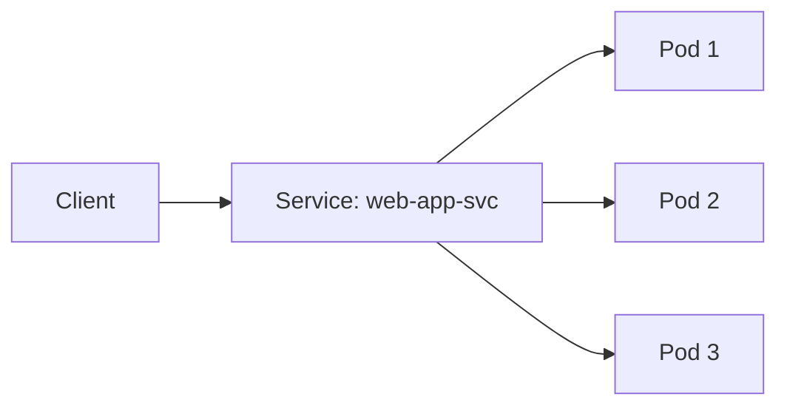

# Services and Networking

Pods are ephemeral — they can be created, destroyed, and rescheduled at any time. A **Service** provides a stable network endpoint that routes traffic to the right Pods, even as they come and go.



## Service types

Kubernetes offers several Service types:

| Type | Description | Use case |
|------|-------------|----------|
| **ClusterIP** | Internal-only IP, reachable within the cluster | Service-to-service communication |
| **NodePort** | Exposes on a static port on every node's IP | Development and testing |
| **LoadBalancer** | Provisions an external load balancer | Production with cloud providers |

## Create a ClusterIP Service

ClusterIP is the default Service type. It gives your Pods a stable internal DNS name and IP.

1. Open :fileLink[k8s/service-clusterip.yaml]{path="k8s/service-clusterip.yaml"} to review:

    ```yaml no-run-button
    apiVersion: v1
    kind: Service
    metadata:
      name: web-app-internal
    spec:
      type: ClusterIP
      selector:
        app: web-app
      ports:
        - port: 80
          targetPort: 80
    ```

    The `selector` field matches the labels on your `web-app` Pods from the previous section.

2. Apply it:

    ```bash
    kubectl apply -f k8s/service-clusterip.yaml
    ```

3. Inspect the Service:

    ```bash
    kubectl get service web-app-internal
    ```

    Notice the `CLUSTER-IP` — this is the internal IP that other Pods can use to reach your app.

4. Test connectivity from inside the cluster using a temporary Pod:

    ```bash
    kubectl run curl-test --image=curlimages/curl --rm -it --restart=Never -- curl -s http://web-app-internal
    ```

    You should see the nginx welcome page HTML. The Service routed traffic to one of your `web-app` Pods.

## Create a NodePort Service

A NodePort Service exposes the application on a port across all nodes, making it accessible from outside the cluster.

1. Open :fileLink[k8s/service-nodeport.yaml]{path="k8s/service-nodeport.yaml"} to review:

    ```yaml no-run-button
    apiVersion: v1
    kind: Service
    metadata:
      name: web-app-nodeport
    spec:
      type: NodePort
      selector:
        app: web-app
      ports:
        - port: 80
          targetPort: 80
          nodePort: 30080
    ```

    This exposes the Service on port `30080` on every node in the cluster.

2. Apply it:

    ```bash
    kubectl apply -f k8s/service-nodeport.yaml
    ```

3. Get the Service details:

    ```bash
    kubectl get service web-app-nodeport
    ```

4. Find a node's internal IP:

    ```bash
    kubectl get nodes -o wide
    ```

5. Test access via the NodePort using one of the node IPs:

    ```bash
    NODE_IP=$(kubectl get nodes -o jsonpath='{.items[0].status.addresses[?(@.type=="InternalIP")].address}')
    curl -s http://$NODE_IP:30080
    ```

    You should see the nginx welcome page.

## View Service endpoints

Services track which Pods are healthy and ready to receive traffic via **Endpoints**.

1. List the endpoints for the ClusterIP Service:

    ```bash
    kubectl get endpoints web-app-internal
    ```

    You should see the IP addresses of your running `web-app` Pods.

2. Scale the Deployment and watch the endpoints update:

    ```bash
    kubectl scale deployment web-app --replicas=5
    ```

3. Check endpoints again — there should now be 5:

    ```bash
    kubectl get endpoints web-app-internal
    ```

4. Scale back down:

    ```bash
    kubectl scale deployment web-app --replicas=3
    ```

## DNS inside the cluster

Kubernetes provides built-in DNS. Any Pod can reach a Service by its name.

1. Test DNS resolution from inside the cluster:

    ```bash
    kubectl run dns-test --image=busybox --rm -it --restart=Never -- nslookup web-app-internal
    ```

    This shows that `web-app-internal` resolves to the Service's ClusterIP. Pods can simply use `http://web-app-internal` as a URL to reach the Service.

> [!NOTE]
> The full DNS name is `web-app-internal.default.svc.cluster.local`, but within the same namespace, the short name `web-app-internal` works.

## Clean up

Leave the Deployment and Services running — you will use them in the next section.

You now understand how Kubernetes Services provide stable networking for your Pods. Next, you will learn how to bridge Docker Compose applications into Kubernetes.
