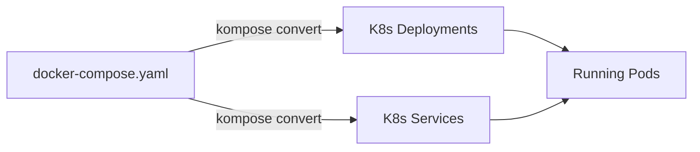

# From Compose to Kubernetes

If you already use Docker Compose, you do not have to rewrite everything from scratch to move to Kubernetes. **Kompose** is a tool that converts Docker Compose files into Kubernetes manifests automatically.



## Install Kompose

1. Download and install the Kompose binary:

    ```bash
    OS=$(uname -s | tr '[:upper:]' '[:lower:]') && ARCH=$(uname -m | sed 's/x86_64/amd64/' | sed 's/aarch64/arm64/') && curl -L "https://github.com/kubernetes/kompose/releases/download/v1.35.0/kompose-${OS}-${ARCH}" -o kompose && chmod +x kompose && sudo mv ./kompose /usr/local/bin/kompose
    ```

2. Verify the installation:

    ```bash
    kompose version
    ```

## Review the sample Compose file

A sample multi-service Docker Compose file is included in your workspace. It defines a classic web application with a frontend, backend API, and Redis cache.

1. Open :fileLink[sample-compose/docker-compose.yaml]{path="sample-compose/docker-compose.yaml"} to review it:

    ```yaml no-run-button
    services:
      web:
        image: nginx:1.27-alpine
        ports:
          - "8080:80"

      api:
        image: hashicorp/http-echo
        command: ["-text=API response from Kubernetes!", "-listen=:5000"]
        ports:
          - "5000:5000"

      redis:
        image: redis:7-alpine
        ports:
          - "6379:6379"
    ```

    This is a simple three-service app — the kind of thing you might run locally with `docker compose up`.

## Convert Compose to Kubernetes

1. Navigate to the sample-compose directory and convert:

    ```bash
    cd sample-compose && kompose convert
    ```

2. List the generated Kubernetes manifests:

    ```bash
    ls -la *.yaml | grep -v docker-compose
    ```

    Kompose generates a Deployment and a Service for each Compose service.

3. Review one of the generated files:

    ```bash
    cat web-deployment.yaml
    ```

    Notice how Kompose translated the Compose `image`, `ports`, and service name into Kubernetes-native resources.

4. Return to the workspace root:

    ```bash
    cd ..
    ```

## Deploy the converted manifests

1. First, clean up the resources from previous sections:

    ```bash
    kubectl delete deployment web-app 2>/dev/null; kubectl delete service web-app-internal web-app-nodeport 2>/dev/null
    ```

2. Apply all the generated manifests at once:

    ```bash
    kubectl apply -f sample-compose/
    ```

    > [!NOTE]
    > `kubectl apply -f <directory>/` applies every YAML file in that directory. The `docker-compose.yaml` file is ignored because it is not a valid Kubernetes manifest.

3. Watch all resources come up:

    ```bash
    kubectl get all
    ```

4. Wait for all Pods to be ready:

    ```bash
    kubectl get pods -w
    ```

    Press `Ctrl+C` once all Pods show `Running`.

## Test the converted services

1. Test the API service from inside the cluster:

    ```bash
    kubectl run curl-test --image=curlimages/curl --rm -it --restart=Never -- curl -s http://api:5000
    ```

    You should see: `API response from Kubernetes!`

2. Test that Redis is reachable:

    ```bash
    kubectl run redis-test --image=redis:7-alpine --rm -it --restart=Never -- redis-cli -h redis ping
    ```

    You should see: `PONG`

## Compare Compose and Kubernetes

Here is a side-by-side comparison of the key concepts:

| Docker Compose | Kubernetes | Purpose |
|----------------|------------|---------|
| `services:` | Deployment + Service | Define and run containers |
| `image:` | `spec.containers[].image` | Container image |
| `ports:` | Service `ports` + `targetPort` | Network access |
| `depends_on:` | No equivalent (use readiness probes) | Startup ordering |
| `volumes:` | PersistentVolumeClaim | Persistent storage |
| `docker compose up` | `kubectl apply -f` | Deploy everything |
| `docker compose down` | `kubectl delete -f` | Tear down everything |

## Clean up everything

Delete all the converted resources:

```bash
kubectl delete -f sample-compose/
```

> [!TIP]
> To remove a Kubernetes cluster, open the **Docker Desktop Dashboard**, go to the **Kubernetes** view, and delete the cluster from there.

## Congratulations! 🎉

You have completed the Kubernetes with Docker Desktop and Kind lab. Here is what you accomplished:

- **Created Kubernetes clusters** using Kind — both single-node and multi-node
- **Deployed Pods** using imperative commands and YAML manifests
- **Managed Deployments** with scaling and rolling updates
- **Exposed applications** with ClusterIP and NodePort Services
- **Bridged Docker Compose to Kubernetes** using Kompose

### Next steps

- Explore [Kubernetes documentation](https://kubernetes.io/docs/home/) for more advanced topics
- Try adding **Ingress** controllers for HTTP routing
- Learn about **ConfigMaps** and **Secrets** for configuration management
- Experiment with **Helm** charts for packaging applications
- Set up **namespaces** for multi-tenant environments
