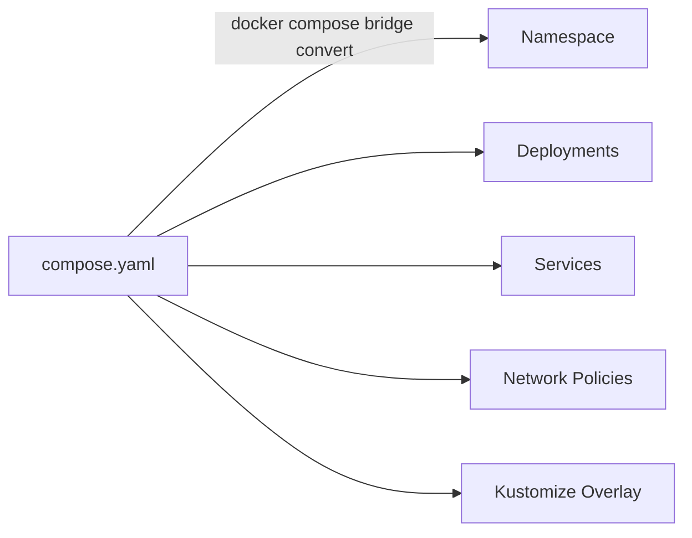

# From Compose to Kubernetes

If you already use Docker Compose, you do not have to rewrite everything from scratch to move to Kubernetes. **Compose Bridge** is built into Docker Desktop and converts your Compose configuration into Kubernetes manifests automatically — no extra tools to install.



## What Compose Bridge generates

The default transformation creates a full set of Kubernetes resources:

| Resource | Purpose |
|----------|---------|
| **Namespace** | Isolates resources from other deployments |
| **Deployments** | Maintains the specified number of replicas for each service |
| **Services** | Enables service-to-service communication and exposes published ports |
| **ConfigMaps** | Contains entries for each config resource in the Compose file |
| **Network Policies** | Replicates the networking topology from the Compose configuration |
| **PersistentVolumeClaims** | Handles volume management |
| **Secrets** | Encoded secrets for local testing |

It also generates a **Kustomize overlay** optimized for Docker Desktop, including LoadBalancer configs and the `desktop-storage-provisioner` for volume handling.

## Review the sample Compose file

A sample multi-service Docker Compose file is included in your project.

1. Review the sample Compose file:

    ```bash
    cat sample-compose/docker-compose.yaml
    ```

    This is a simple three-service app (nginx, an API, and Redis) — the kind of thing you might run locally with `docker compose up`.

## Convert Compose to Kubernetes manifests

1. Run the Compose Bridge conversion from the sample-compose directory:

    ```bash
    docker compose -f sample-compose/docker-compose.yaml bridge convert
    ```

    This reads the Compose file and generates Kubernetes manifests in the `out/` directory.

2. Explore the generated output:

    ```bash
    find out/ -type f
    ```

    You should see a structured directory with manifests and a Kustomize overlay for Docker Desktop.

3. Review the generated Deployment for the web service:

    ```bash
    cat out/web-deployment.yaml 2>/dev/null || cat out/*web* 2>/dev/null || ls out/
    ```

    Notice how Compose Bridge translated the Compose `image`, `ports`, and service name into Kubernetes-native resources.

## Deploy to Kubernetes

1. First, clean up the resources from previous sections:

    ```bash
    kubectl delete deployment web-app 2>/dev/null; kubectl delete service web-app-internal web-app-nodeport 2>/dev/null
    ```

2. Apply the generated manifests using the Docker Desktop Kustomize overlay:

    ```bash
    kubectl apply -k out/overlays/desktop/
    ```

    > [!TIP]
    > The `-k` flag tells kubectl to use Kustomize, which applies the overlay with Docker Desktop-specific settings like the storage provisioner and LoadBalancer configuration.

3. Check all resources that were created:

    ```bash
    kubectl get all
    ```

4. Wait for all Pods to be ready:

    ```bash
    kubectl get pods -w
    ```

    Press `Ctrl+C` once all Pods show `Running`.

## Test the deployed services

1. Test the API service from inside the cluster:

    ```bash
    kubectl run curl-test --image=curlimages/curl --rm -it --restart=Never -- curl -s http://api:5000
    ```

    You should see: `API response from Kubernetes!`

2. Test that Redis is reachable:

    ```bash
    kubectl run redis-test --image=redis:7-alpine --rm -it --restart=Never -- redis-cli -h redis ping
    ```

    You should see: `PONG`

3. Access the web service via port-forward:

    ```bash
    kubectl port-forward svc/web 8080:80 &
    ```

4. Curl the forwarded port:

    ```bash
    curl -s http://localhost:8080
    ```

    You should see the nginx welcome page HTML.

5. Stop the port-forward:

    ```bash
    kill %1 2>/dev/null
    ```

## Compare Compose and Kubernetes

Here is a side-by-side comparison of the key concepts:

| Docker Compose | Kubernetes | Purpose |
|----------------|------------|---------|
| `services:` | Deployment + Service | Define and run containers |
| `image:` | `spec.containers[].image` | Container image |
| `ports:` | Service `ports` + `targetPort` | Network access |
| `depends_on:` | No equivalent (use readiness probes) | Startup ordering |
| `volumes:` | PersistentVolumeClaim | Persistent storage |
| `docker compose up` | `kubectl apply -k` | Deploy everything |
| `docker compose down` | `kubectl delete -k` | Tear down everything |

## Clean up everything

Delete all the deployed resources:

```bash
kubectl delete -k out/overlays/desktop/
```

Clean up the generated manifests:

```bash
rm -rf out/
```

> [!TIP]
> To remove a Kubernetes cluster, open the **Docker Desktop Dashboard**, go to the **Kubernetes** view, and delete the cluster from there.

## Congratulations! 🎉

You have completed the Kubernetes on Docker Desktop lab. Here is what you accomplished:

- **Enabled Kubernetes** on Docker Desktop via GUI and CLI
- **Created clusters** — single-node (Kubeadm) and multi-node (Kind)
- **Deployed Pods** using imperative commands and YAML manifests
- **Managed Deployments** with scaling and rolling updates
- **Exposed applications** with ClusterIP and NodePort Services
- **Bridged Docker Compose to Kubernetes** using Compose Bridge

### Next steps

- Explore [Kubernetes documentation](https://kubernetes.io/docs/home/) for more advanced topics
- Try adding **Ingress** controllers for HTTP routing
- Learn about **ConfigMaps** and **Secrets** for configuration management
- Experiment with **Helm** charts for packaging applications
- Set up **namespaces** for multi-tenant environments
